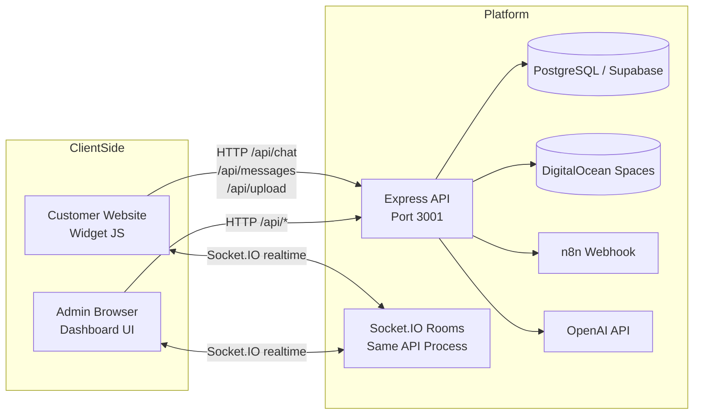
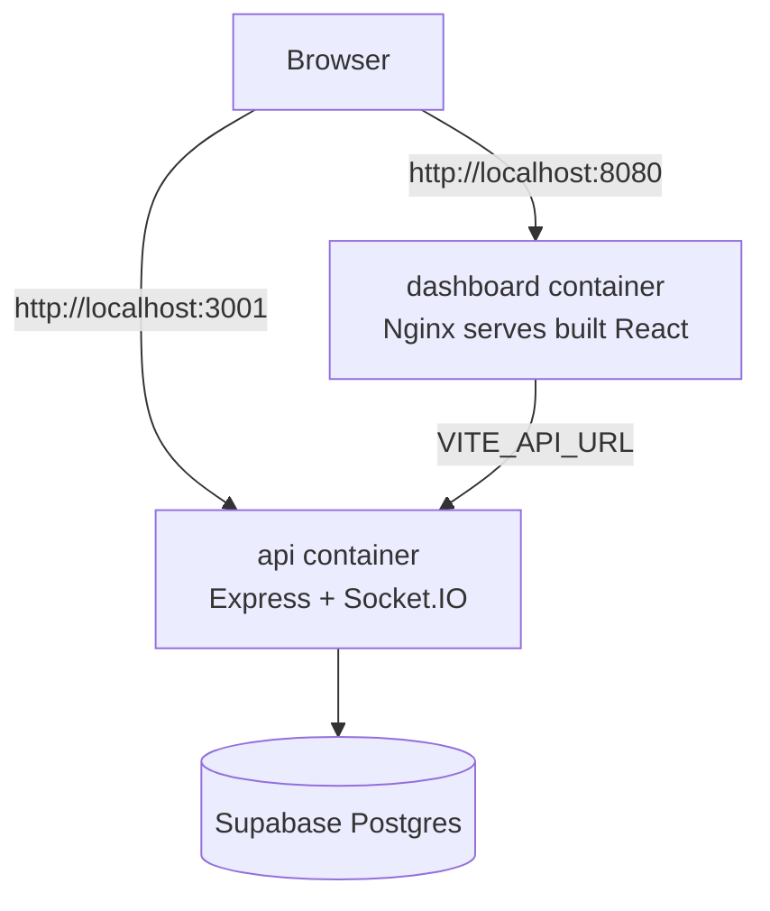

# System Architecture

This project is a real-time support platform with four major parts:

1. `Widget` embedded on customer website
2. `API + Socket server` (Express + Socket.IO)
3. `Dashboard` (React admin UI)
4. `Data/Integrations` (PostgreSQL/Supabase, n8n, OpenAI, DigitalOcean Spaces)

## High-Level System Diagram

## Docker Runtime Diagram

## Core Flows

### 1. Customer Chat Flow
1. Widget sends message to `POST /api/chat` (AI mode) or `POST /api/messages`.
2. API stores/updates session + message in DB.
3. API emits `new_message` + `session_update` through Socket.IO.
4. Dashboard receives realtime updates.

### 2. Human Handoff Flow
1. User message matches handoff phrase.
2. API marks session status as `human`.
3. API stores handoff response and emits `status_change`.
4. Admin replies from dashboard via Socket.IO event `send_manual_message`.

### 3. File Upload Flow
1. Widget picks/pastes file and sends `POST /api/upload`.
2. API validates mime/type/size (up to 20 MB).
3. API uploads binary to DigitalOcean Spaces.
4. API stores file payload as a chat message in DB.
5. Dashboard and widget render the file message.

### 4. Analytics + Reports Flow
1. Dashboard fetches analytics endpoints (`/api/analytics`, `/api/analytics/top-queries`).
2. API calculates metrics from sessions/messages tables.
3. GPT-powered summary/report endpoints call OpenAI and return structured JSON.

## Why It Looks Like "Two Servers"

You currently run two application services in Docker:

1. `api` on port `3001` for backend + realtime + widget static files
2. `dashboard` on port `8080` for the admin frontend (served by Nginx)

This is normal and recommended for separation of concerns. See `docs/deployment-options.md` for single-service alternatives.

## Key Design Constraints

- Real-time updates require Socket.IO connectivity to API.
- AI integration requires outbound call to n8n and/or OpenAI.
- File sharing requires object storage (Spaces) plus DB message persistence.
- Dashboard is build-time static assets + runtime API URL.

## Security Notes

- Add admin auth for sensitive dashboard endpoints if exposing publicly.
- Restrict `CORS_ORIGIN` in production.
- Keep `DO_SPACES_*`, `OPENAI_API_KEY`, DB credentials out of source control.
- Consider signed uploads (or private bucket + signed URLs) for stricter file privacy.
